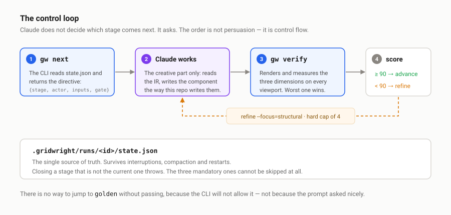
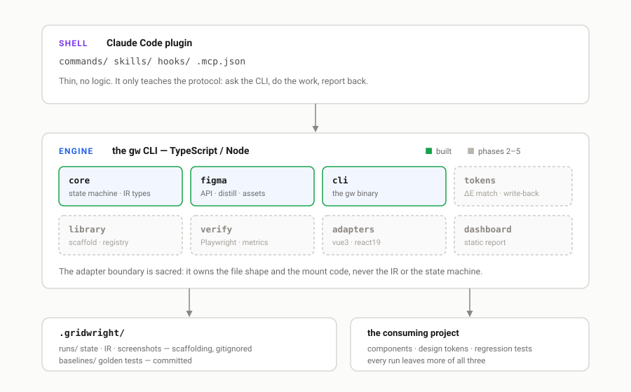
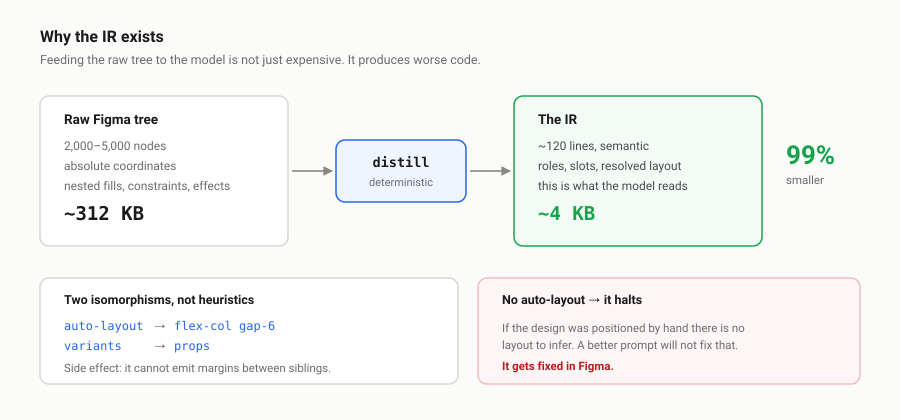
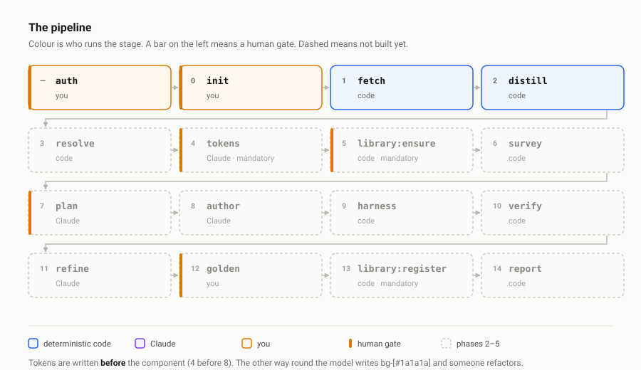

# Gridwright

End-to-end layout pipeline. A Figma node goes in; a built, visually verified
component registered in the project's design system comes out. Driven from
Claude Code.

[](LICENSE)


> **The design comes in as a node and leaves as a system.**
>
> Gridwright does not generate components: it builds the project's design system
> one node at a time. Every run leaves the repo with more resolved tokens, more
> registered components and more verified surface. If a component turns out fine
> but contributed nothing to the system, the run failed.

**Status: all five phases built.** A run goes from a Figma node to a registered
component, in either mode: fetch, distill, resolve, write tokens, survey, plan,
author, render, score, refine, freeze a baseline, register, report.

What that does not mean is finished. It has been calibrated against components
built by hand and run against a real project's 54 components, but it has not
built anything anyone shipped yet. See [known gaps](#known-gaps).

---

## The idea

The obvious temptation is to write a long prompt explaining to an agent how to
build a layout. That has been tried: an earlier repo has a five-phase workflow
written in prose, and the agent skips the analysis phase every time the request
looks simple. **A prompt is a suggestion.**

Gridwright inverts the split. The state machine lives on disk and a CLI enforces
it. Claude does not decide which stage comes next: it asks.



```console
$ gw next --json
{
  "run": "hero-about-us-01",
  "stage": "author",
  "actor": "agent",
  "action": "write the component",
  "inputs": { "ir": "…/ir.json", "reference": "…/reference.png" },
  "gate": null
}
```

The split of labour is explicit:

| Code does this | The model does this |
|---|---|
| Pull the node, the assets and the reference | Write the component idiomatically for this repo |
| Distill the tree into the IR | Name things, decide the prop API |
| Match and classify tokens | Name the new tokens |
| Index existing components | Decide what to reuse |
| Render, measure, diff | Read the diff and fix it |

If it can be checked with an assert, the model does not do it. If it needs
judgment about code that already exists, the program does not do it.

---

## Architecture

Three layers. The Claude Code plugin is a thin shell that only teaches the
protocol; all the logic lives in the `gw` binary; the outputs land in the
consuming project.



```
packages/
├── core/     IR types, state machine, scoring, config, credentials
├── figma/    API client, distill, asset extraction
├── tokens/   read the project's tokens, classify, write back
├── library/  scaffold, barrel, registry
├── verify/   ephemeral harness, Playwright, perceptual diff
└── cli/      the gw binary
```

**Stack**: TypeScript, Node, pnpm workspaces. Vitest for the core, Playwright
for verify, `sharp` for assets, `odiff` for the perceptual diff, `ts-morph` and
`postcss` for the token write-back.

---

## Install

```bash
npm i -g @gridwright/cli     # the engine
gw auth login                # once per machine
```

And in Claude Code, the plugin that teaches it the protocol:

```
/plugin marketplace add BalbianoLuciano/gridwright
/plugin install gridwright@gridwright
```

The plugin is a thin shell — three commands, one skill, one hook. It holds no
logic: it teaches Claude to ask `gw next` and obey, and it surfaces a run left
open in a previous session. Everything it knows, the CLI enforces anyway.

**You type the Figma token yourself, in your terminal.** Never through the
agent: once it is in a message it is in the transcript, in the context and in
persistent memory, and has to be treated as compromised. Inside Claude Code, the
`!` prefix runs in your shell, outside the conversation:

```
! gw auth login
```

`gw auth login` reads from hidden stdin and validates against the API before
saving anything, to `~/.config/gridwright/credentials.json` with mode `0600`.
There is no `--token` flag: an argument lands in the shell history and in `ps`.

---

## Usage

In the repo where the component will live:

```bash
gw init                      # detects framework, tokens and library. Once.
gw build "https://www.figma.com/design/<KEY>/<name>?node-id=3978-35299"
```

`gw init` does not ask what it can find out. The framework comes from
`package.json`, and the token destination is **searched for** rather than
assumed: there are projects on Tailwind 4 that still declare their tokens in a
legacy `tailwind.config.js`. "Which version do you have installed" and "where
are your tokens declared" are different questions.

```console
$ gw build "https://www.figma.com/design/D7qf…?node-id=3978-35299"
✓ Run hero-about-us-01 — frame "Hero About Us" → HeroAboutUs
→ 3 assets
    · hero-about-us.png 1440x405 · trimmed 1440x512 → 1440x405
→ IR: 4 nodes, 6 raw values (312KB → 4KB, 99% smaller)
    hash a3f2c1d4e5b6
```

| Command | |
|---|---|
| `gw build <url>` | opens a run and executes as far as it goes |
| `gw next [--json]` | which stage is up and who runs it — **the protocol** |
| `gw status` | runs and the stage each one is on |
| `gw ir [<run>]` | prints the IR |
| `gw auth status` | which credential is in use and where it came from |

---

## The IR

The raw tree of a frame is 2,000 to 5,000 nodes. Feeding it to the model is not
just expensive: it produces **worse** results, because the model latches onto
the `absoluteBoundingBox` values it sees and writes `position: absolute`. The
distillation always sits between Figma and the model.



```json
{
  "name": "HeroAboutUs",
  "layout": { "kind": "flex", "dir": "col", "gap": 24, "align": "center" },
  "tokens": { "bg": "#1a1a1a" },
  "children": [
    { "role": "image", "name": "Hero Background", "asset": "hero-background.png", "ratio": "32/9" },
    { "role": "heading", "level": 1, "slot": "title", "default": "About us" }
  ],
  "warnings": [],
  "hash": "a3f2c1d4e5b6"
}
```

Two of the translations are isomorphisms, not heuristics:

**Auto-layout is flex with gap.** `layoutMode` + `itemSpacing` +
`primaryAxisAlignItems` map one to one onto `flex-col gap-6 justify-*`. Valuable
side effect: gridwright **cannot** generate margins between siblings, because
Figma never gives it that information.

**Variants are props.** A component with `Size=Large, State=Hover` hands over
the matrix without anything being invented.

And an uncomfortable corollary: if the Figma does not use auto-layout, there is
no layout to extract. A better prompt will not fix that. `distill` detects it
and halts.

```console
✗ The IR is not usable.

  7 nodes are absolutely positioned (the tolerated maximum is 5).
  This frame does not use auto-layout, so there is no layout to infer.
  A better prompt will not fix this: it gets fixed in Figma.
```

---

## The stages



Three human gates: `plan`, `tokens` and `golden`. Nothing that mutates the
project is written without approval. A badly generated component is rewritten in
ten minutes; a contaminated token system is inherited forever.

Three stages are mandatory and cannot be skipped even with a reason — `tokens`,
`library:ensure` and `library:register`. They are the ones that build the
system, and therefore the ones a hurried agent would skip first.

And note the ordering of 4 and 8: **tokens are written before the component.**
The other way round, the model writes `bg-[#1a1a1a]` and someone has to
refactor.

---

## Verification

Figma's text engine and Chromium's differ in kerning and antialiasing: a
**perfect** component comes out 3–8% different at the pixel level. A raw diff
threshold at 1% is never reached, and at 10% anything passes. Hence a composite
score:

| Dimension | Weight | How it is measured | Noise |
|---|---|---|---|
| Structural | 50% | bounding boxes, ±2px tolerance | none |
| Chromatic | 25% | colour sampling, ΔE | none |
| Perceptual | 25% | pixel diff with a mask over text | high |

Threshold **90%**, over the **worst viewport, not the average**: if it breaks on
mobile, it is broken. When it falls short, refine is not "try again" — it
receives what failed and where, which is what makes it converge in two
iterations instead of burning tokens up to the cap.

---

## Roadmap

| Phase | What | Status |
|---|---|---|
| 0 | The spec | ✅ [`specs/001-pipeline.md`](specs/001-pipeline.md) |
| 1 | CLI, state machine, `fetch`, `distill` | ✅ |
| 2 | `verify` with Playwright, on a hand-written component | ✅ |
| 3 | Claude Code plugin, `author`, `refine` | ✅ |
| 4 | `tokens`, `library`, `golden`, dashboard | ✅ |
| 5 | View mode: `survey` and composition | ✅ |

**Phase 2 comes before phase 3 on purpose.** If you cannot measure, you cannot
close the loop: a generative pipeline without a calibrated metric is a text
generator with extra steps. The ruler first, then the factory.

---

## Development

```bash
pnpm install
pnpm test        # 165 tests
pnpm typecheck
pnpm build
```

The `distill` tests run against fixtures shaped like real Figma API responses,
including a frame without auto-layout that **must** make the pipeline halt.

The diagrams in `docs/` are hand-written SVG — no build step, no diagramming
dependency, and they render on npm as well as on GitHub.

## Known gaps

Written down rather than left to be discovered:

- **The threshold is lenient when there is no reference image.** The perceptual
  dimension drops out, the other two are reweighted, and structural ends up
  carrying two thirds — so a component visibly 8px off can still clear 90. A
  per-dimension floor would fix it; today it is only pinned by a test.
- **`survey` is name-first.** It matches what a design and a component are
  called, falls back to a rough shape, and says which signal it used. It will
  miss a component that does the same job under a different name.
- **`gw init` at the root of a nested project guesses wrong rather than
  failing.** A React app under `src/theme/` is detected as `vue3` with no
  tokens. Run it where the frontend actually lives.
- **The adapter is named `react19` regardless of the installed version.** It
  does not matter until the adapter writes code — React 19 dropped
  `forwardRef` and made `ref` a normal prop.
- **The registry stores raw values, not token names.** `resolve` does not
  rewrite `ir.json`, so a component records `#1a1a1a` where it should record
  `colors.neutral.900`.

## Non-goals

- It does not generate design. It translates the design that exists.
- It does not fix a badly built Figma. It detects and reports it.
- No data fetching, routing or business logic.
- It does not chase pixel-perfect.
- It does not publish, commit or push anything on its own.

## License

[MIT](LICENSE) © Luciano Balbiano
